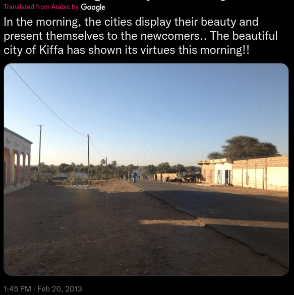
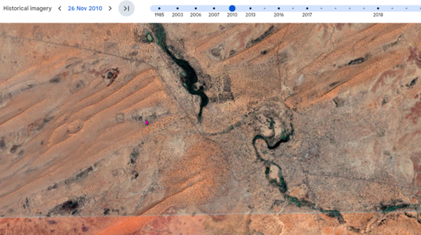
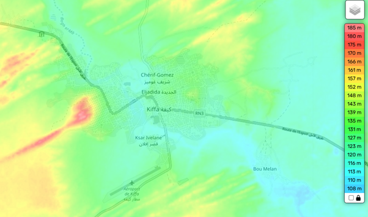
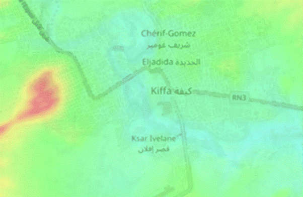
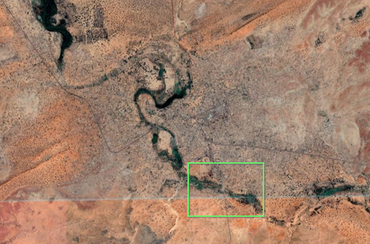
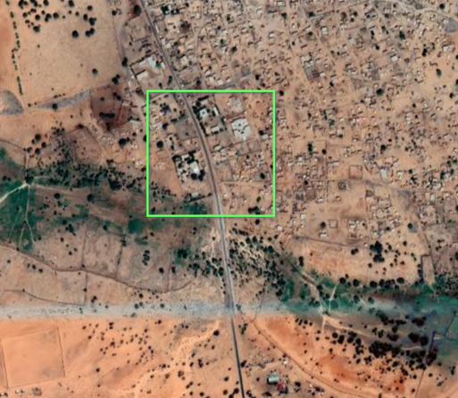
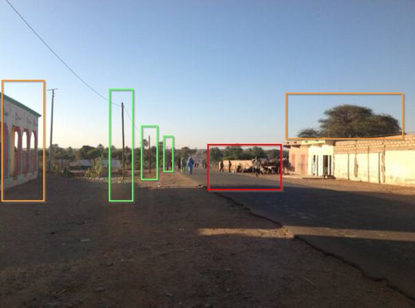

# OSINT

This investigation is based on OSINT Exercise 001 created by Sofia Santos.  
Original exercise and briefing are available at:  
https://gralhix.com/list-of-osint-exercises/

## Task briefing:
“Below you can see a screenshot from a tweet containing a photo. It contains all the relevant information necessary to help you find the exact location.  
Please identify the coordinates of where the photo was taken.”

---

## Image for Educational Purposes
The tweet says picture was taken in Kiffa in the morning. Okay, let’s google Kiffa, it’s in Mauritania. I want to know more about Kiffa.  
Let’s navigate to the Wikipedia page for Kiffa. So “the climate is Sahelian, with April to June as the hottest months and eighty-five percent of the low annual rainfall occurring from July to September.” Okay so desert, also found a snippet about a meteorite impact in 1970. Interesting, but not relevant to the challenge.  
Onwards.

Studying Google Maps, there are no street view maps available. Google! Get the van ready for a road trip! There are some random pictures of different locations in Kiffa, but not what we want.

Okay, so re-reading the tweet, (focus now). Picture was taken in the morning. So, if that is true, (we could have an unreliable narrator, but probably not), the road is facing south.

So, I’m going to Google Earth now. First thing, the tweet is from 2013. So, I’m going to set Google Earth to 2013 imagery before diving in, no point trying to match the landscape with today’s changes.

Oh look.! There is 18/07/2013 satellite image or 26/10/2013 satellite image available.  
Well, the tweet is dated 20 February 2013. I’m going to switch between these two dated.

Edit - Nope! I’m going to use the 2010 data, as the 2013 image pixelates when you zoom in.  
Here we are looking at the overall image of Kiffa, and I’ve removed the labels and details from the map. This is the 2010 image data. Beautiful.

**SOURCE:** Google Earth  
Here we are looking at the overall image of Kiffa, and I’ve removed the labels and details from the map. This is the 2010 image data. Beautiful.

---

Now when you do a 1000+ piece jigsaw puzzle and have all the jumbled-up pieces in front. Do you look for the edges or at the colours first?  
Well, in this scenario we are going to look at the colours.

The Kiffa satellite map we are looking at is dark green, and dusty brown, and earthy red/oranges. (I’m going back to study the original tweet image).

Studying the image again. There is a dip. Is that dip a waterway or a river?? Lots of trees in this image, and the wiki page said this was desert environment.

As we can see from the satellite image of Kiffa, there’s a river to the north-west, and a swimming lake. There is also trail of greenery which looks like it follows a river.

---

## Two trains of thought.

### ROUTE A:
Follow the green trail. Green grows where the water flows.

### Route B:
Topography. I was forced to go hiking as a child. Up in the freezing cold mountains, with an ice axe and everything. So, what I do remember is being quizzed at 1000+meters on map skills. Things like, where are we now, how long will it take to climb 100 metres, is this convex or concave.

So, I’m going to follow both route A and B. Following the green trail and look at differences in elevation.

---

**Source:** topographic-map.com  
Here is a topographic map of Kiffa, the blue is lower elevation levels, and it looks like the lower elevation match the water flow and the tree growth.

So, my brain already linked the two together, but I’ve overlayed the topographic map with Google Earth so you can see how my brain worked. Fun isn’t it!

**Source:** I made this by combing Google Earth with topographic-map.com
---

## OK so now, narrowing down the target.

The image is of Kiffa.  
Picture was taken in the morning.  
The shadows show the road is heading south in direction.  
The image shows a road with a dip, with possibly a river and trees on either side.  
Also desert on the horizon.

---

We are going to look here in more detail.  
As its’s a southern road, with the trees on either side of the road, and there is an area here where the elevation is lower.

**SOURCE:** Google Earth  
Yep, this looks promising.

I look back on the original tweet image and realise something!  
Ahha! The road isn’t straight. It bends out to the right. It’s not a detail I noticed first time looking. Silly me!

That’s why it’s good to really look at an image and examine it in detail. This matches the satellite image we are looking at.

**SOURCE:** Google Earth  
Yes! Now gather round, and let’s hyper focus in.  
Now we can look at the buildings and the telegraph poles.

**SOURCE:** Twitter 
Here we have landmarks, three telegraph poles, building on the left, the wall and the tree. This can be used to point the location the photograph was taken.

The co-ordinates where the picture was taken is **16°36'34"N 11°23'52"W**.

LOL.. it took me longer to do this write up, than the actual challenge.

---

Exercise created by **Sofia Santos (gralhix.com)**.  
Walkthrough and analysis are my own.
