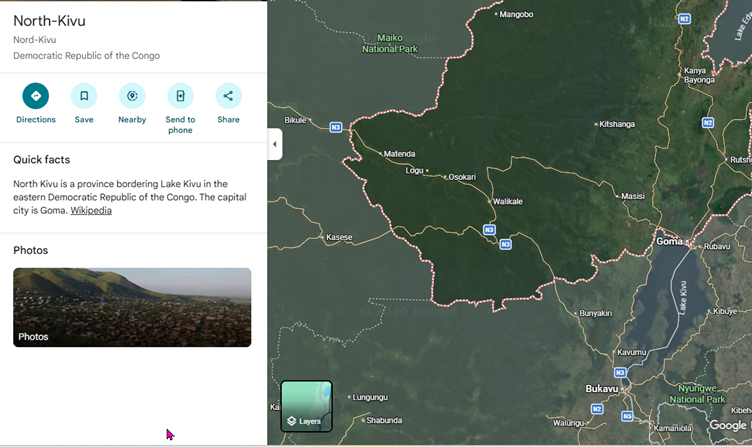
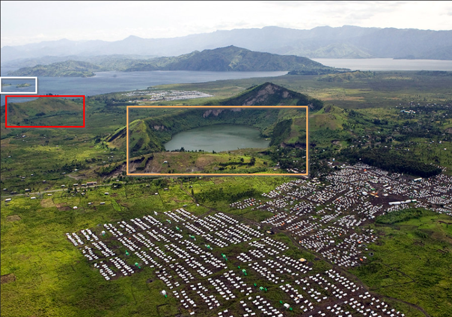
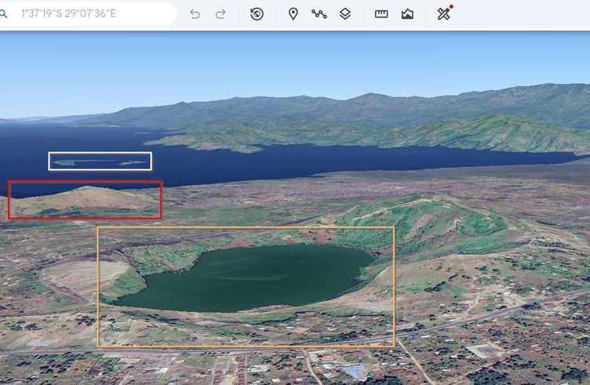
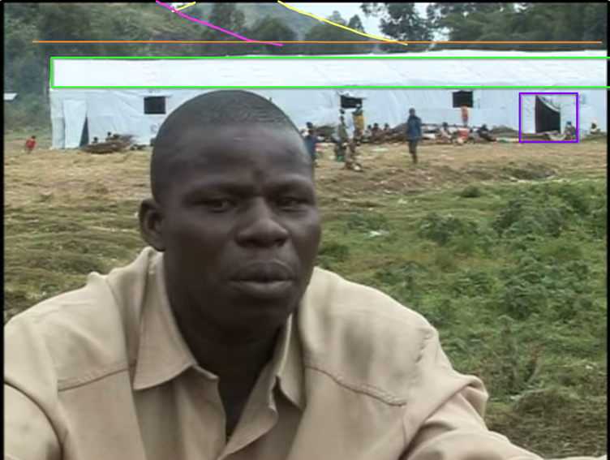
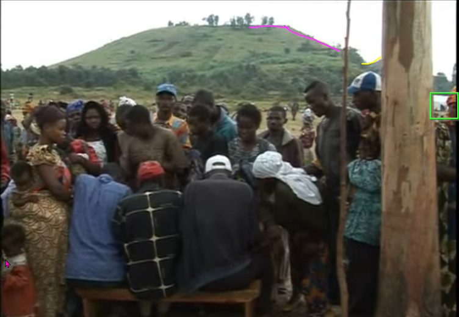
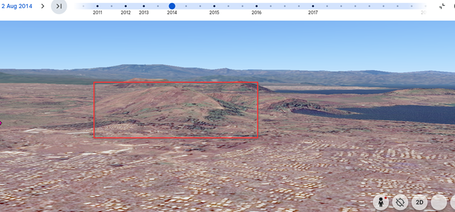
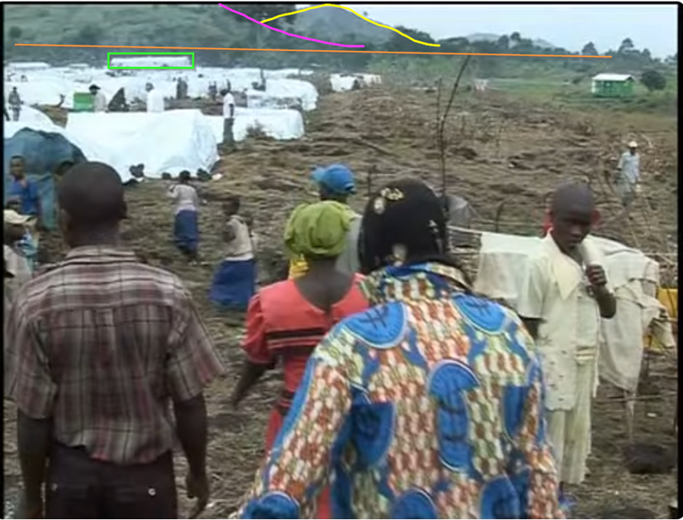
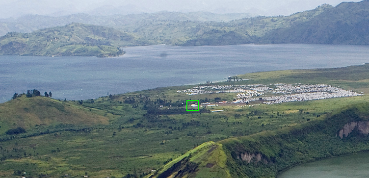
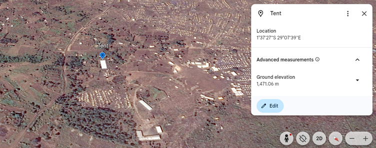

# OSINT

This investigation is based on OSINT Exercise 030 created by Sofia Santos.  
Original exercise and briefing are available at:  
https://gralhix.com/list-of-osint-exercises/

## Task Briefing

> “The video below, published in October 2007, shows the situation in a refugee camp in the Democratic Republic of the Congo. The structures seen in the footage are long gone, as the conflict in the region waxes and wanes. Geolocating temporary accommodations is often challenging, as satellite images are scarce and the situation on the ground volatile. It is, however, still possible.”

**Task:**  
a) Find the exact location of the white tent seen in the video below at the 1:16 minute mark.

Source video: 

---

## Initial Analysis

Beginning the analysis, the video was uploaded to YouTube on 24th October 2007. The camp is in the Democratic Republic of Congo. The subtitles read "beleno Camp west of the GMA". The video shows what looks like a lake.

 
*Source: Google Maps*
 
A search on Google Maps for North Kivu reveals text, the North Kivu province boarders Lake Kivu in the Eastern DRC. Here on the lake, there is a city called Goma. So, GMA is likely Goma? Maybe.

The subtitles in the video are "beleno Camp west of the GMA”. I listened to the video dialogue and it sounds like Belengo, not Beleno.

A search for names of refugee camps in North Kivu in 2007 returns a news article ([UN News](https://news.un.org/en/story/2007/10/236452)) dated 19 October 2007. Five days before the news report was uploaded onto YouTube. The online news article names “Bulengo”, as the first refugee camp in the area. This name is the closest I can see to "Beleno" or “Belengo”. 

---

## Finding Bulengo Camp

Now looking for Bulengo refugee camp west of Goma via image search, I have found an aerial image of Bulengo camp from Flickr. It was uploaded to the United Nations photostream in 2011, but states picture was taken on April 4th 2008.

The image shows Bulengo camp in the background with Mugunga I and II in the foreground. Notice what looks like a crater lake, and Lake Kivu in the background, with small land masses of varying sizes, possibly islands.

 
*Source: Marie Frechon / United Nations Flickr*
 

## Google Earth Analysis

The small lake, which looks like it’s in a crater, is Lac Vert, or in English, Green Lake. The horseshoe shaped island in the background is Tchegera Island.  
On Google Earth there is no available satellite data of Bulengo Camp from 2007. The closest date available is 2014. So, bear in mind tents move, structures may have been destroyed or constructed, trees grow and roads may have been built.

---

## Tent Location Analysis

With the location of Bulengo Camp confirmed, moving onwards to find the location of the tent from the image. Going back to the video to take screenshots. There are some long white structures here on this satellite image of Bulengo camp from 2014, but there is no evidence to indicate how long they have been here. Examining elements from the video may help to pinpoint some landmarks.

 
*Source: United Nations*
 
Here we are interested in verifying the location of this long white tent. Notice the outline of possibly two hills/mountains, the line of trees behind the tent, the tent door open. The tent we need to locate is highlighted in green, note the topography on the horizon, and the line of trees behind the long tent.

 
*Source: United Nations*
 
After capturing multiple screenshots and analysing many images, I think we have found the tent in an image. In the green highlighted box is highly likely the tent we are looking for, as the door shape matches our target tent. Topographical features also match. I have found the correct mountain in the background, and have highlighted it Google Earth below.

 
*Source: Google Maps*
 

## Final Comparison and Coordinates

In this screenshot, we can identify the slopes in the horizon, marked in pink and yellow, the tree line and I’ve highlighted in green, what I think is a likely candidate for the tent.

 
*Source: Google Maps*
 

Now I spent a while trying to pinpoint the exact location of the tent using trees. I got a bit discombobulated and decided to look back over all the evidence collected. The image uploaded to the UN Flickr account dated 04/04/2008, is the closest image in date to 24 October 2007. 

Zoom in on the picture, and you can see the tent.

 
*Source: Google Maps / Marie Frechon / United Nations Flickr*
 
Here is a side-by-side comparison:

 
*Source: Google Maps*
 
Finally, co-ordinates for the tent location.

